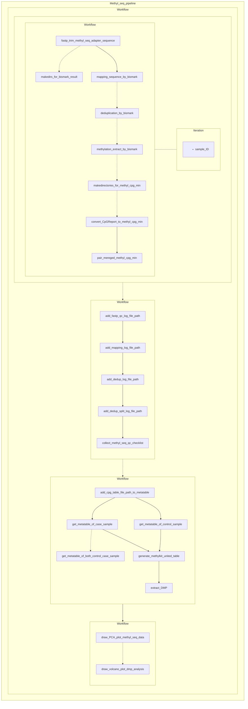
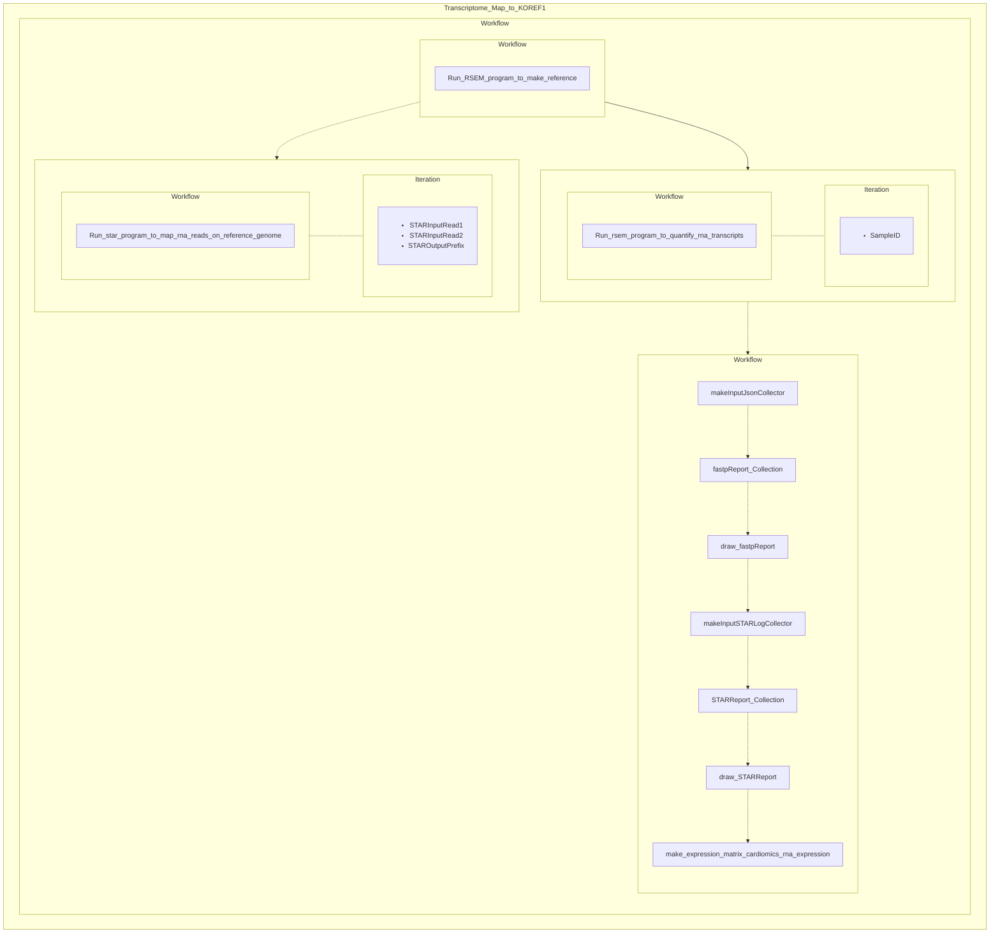
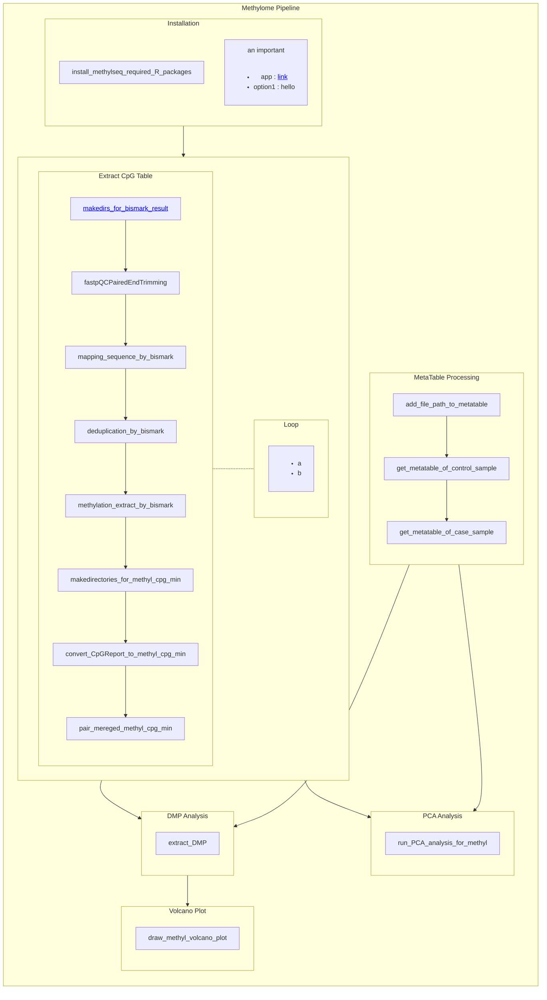

## section0

```mermaid
flowchart TB
subgraph Total["Methyl_seq_pipeline"]
		subgraph workflow_1[Workflow]
						subgraph workflow_2[" "]
						direction LR
						subgraph workflow_works2[Workflow]
									job_3["fastp_trim_methyl_seq_adapter_sequence"]
									job_4["makedirs_for_bismark_result"]
									job_5["mapping_sequence_by_bismark"]
									job_6["deduplication_by_bismark"]
									job_7["methylation_extract_by_bismark"]
									job_8["makedirectories_for_methyl_cpg_min"]
									job_9["convert_CpGReport_to_methyl_cpg_min"]
									job_10["pair_mereged_methyl_cpg_min"]
									job_3-.->job_4
									job_3-->job_5
									job_5-.->job_6
									job_6-.->job_7
									job_7-.->job_8
									job_8-.->job_9
									job_9-->job_10
						end
						subgraph workflow_iteration2["Iteration"]
						direction TB
						IterationNode2[<ul><li>sample_ID</li></ul>]
						end
						workflow_works2-.-workflow_iteration2
						end
						subgraph workflow_11[Workflow]
									job_12["add_fastp_qc_log_file_path"]
									job_13["add_mapping_log_file_path"]
									job_14["add_dedup_log_file_path"]
									job_15["add_dedup_split_log_file_path"]
									job_16["collect_methyl_seq_qc_checklist"]
									job_12-->job_13
									job_13-->job_14
									job_14-->job_15
									job_15-->job_16
						end
						subgraph workflow_17[Workflow]
									job_18["add_cpg_table_file_path_to_metatable"]
									job_19["get_metatable_of_control_sample"]
									job_20["get_metatable_of_case_sample"]
									job_21["get_metatable_of_both_control_case_sample"]
									job_22["generate_methylkit_united_table"]
									job_23["extract_DMP"]
									job_18-->job_19
									job_18-->job_20
									job_20-.->job_21
									job_19-->job_22
									job_20-->job_22
									job_22-->job_23
						end
						subgraph workflow_24[Workflow]
									job_25["draw_PCA_plot_methyl_seq_data"]
									job_26["draw_volcano_plot_dmp_analysis"]
									job_25-.->job_26
						end
				workflow_2-.->workflow_11
				workflow_11-.->workflow_17
				workflow_17-->workflow_24
		end
	
end
```

## section1

[test](README.md)

<a href=README.md>test2</a>

```mermaid
flowchart TB
subgraph Total["Transcriptome_Map_to_KOREF1"]
		subgraph workflow_1[Workflow]
						subgraph workflow_2[Workflow]
									job_3["Run_RSEM_program_to_make_reference"]
									
						end
						subgraph workflow_4[" "]
						direction LR
						subgraph workflow_works4[Workflow]
									job_5["Run_star_program_to_map_rna_reads_on_reference_genome"]
									
						end
						subgraph workflow_iteration4["Iteration"]
						direction TB
						IterationNode4[<ul><li>STARInputRead1</li><li>STARInputRead2</li><li>STAROutputPrefix</li></ul>]
						end
						workflow_works4-.-workflow_iteration4
						end
						subgraph workflow_6[" "]
						direction LR
						subgraph workflow_works6[Workflow]
									job_7["Run_rsem_program_to_quantify_rna_transcripts"]
									
						end
						subgraph workflow_iteration6["Iteration"]
						direction TB
						IterationNode6[<ul><li>SampleID</li></ul>]
						end
						workflow_works6-.-workflow_iteration6
						end
						subgraph workflow_8[Workflow]
									job_9["makeInputJsonCollector"]
									job_10["fastpReport_Collection"]
									job_11["draw_fastpReport"]
									job_12["makeInputSTARLogCollector"]
									job_13["STARReport_Collection"]
									job_14["draw_STARReport"]
									job_15["make_expression_matrix_cardiomics_rna_expression"]
									job_9-.->job_10
									job_10-.->job_11
									job_11-.->job_12
									job_12-.->job_13
									job_13-.->job_14
									job_14-.->job_15
						end
				workflow_2-.->workflow_4
				workflow_2-->workflow_6
				workflow_6-.->workflow_8
		end
	
end


```

## section2

```mermaid
  flowchart TB
    subgraph Total["Methylome Pipeline"]
      direction TB
      subgraph WS1["Installation"]
        direction TB
        W1["install_methylseq_required_R_packages"]
        click W1 href "http://www.github.com"
        B[an important <br><br> <ul> <li>app : <a href='http://google.com'>link</a></li> <li>option1 : hello</li> </ul>]
      end
      subgraph WS2[" "]
        direction LR
        subgraph WS2Loop["Extract CpG Table"]
          direction TB
          W2[<a href=./README.md>makedirs_for_bismark_result</a>]-->W3["fastpQCPairedEndTrimming"]
          W3-->W4["mapping_sequence_by_bismark"]
          W4-->W5["deduplication_by_bismark"]
          W5-->W6["methylation_extract_by_bismark"]
          W6-->W7["makedirectories_for_methyl_cpg_min"]
          W7-->W8["convert_CpGReport_to_methyl_cpg_min"]
          W8-->W9["pair_mereged_methyl_cpg_min"]
        end
        subgraph WS2LoopVariable["Loop"]
          direction TB
          WS2Var1[<ul><li>a</li><li>b</li></ul>]
        end
        WS2Loop-.-WS2LoopVariable
      end
      subgraph WS3["MetaTable Processing"]
        direction TB
        W10["add_file_path_to_metatable"]-->W11["get_metatable_of_control_sample"]
        W11-->W12["get_metatable_of_case_sample"]
      end
      subgraph WS4["DMP Analysis"]
        direction TB
        W13["extract_DMP"]
      end
      subgraph WS5["PCA Analysis"]
        direction TB
        W14["run_PCA_analysis_for_methyl"]
      end
      subgraph WS6["Volcano Plot"]
        direction TB
        W15["draw_methyl_volcano_plot"]
      end
      WS1-->WS2
      WS2-->WS4
      WS3-->WS4
      WS3-->WS5
      WS2-->WS5
      WS4-->WS6
    end
```
